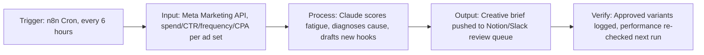

# Proposal: Marketing Automation Specialist, Meta Ads Creative Strategy

## Hook
You've got a 10-step process mapped out and want someone to pressure-test it, then build the automations. I put together a working version of the creative fatigue audit piece before applying, so you can see how I'd approach it.

## Demo Reference
Live app: https://meta-ads-creative-automation-demo.streamlit.app/

What it shows:
- Pulls per-campaign performance (spend, CTR, frequency, CPA, days running) across 4 sample campaigns
- Scores each one for creative fatigue risk and explains why (frequency creep, stale creative, CTR decay)
- Auto-generates 3 ready-to-test hook variants plus a recommended format for anything flagged
- Ranks the account so you know what to fix first instead of guessing

Screenshots attached.

## Architecture

Full stack:
- **Trigger:** n8n cron, or your existing tool if you'd rather stay in Zapier/Make
- **Input:** Meta Marketing API pulling spend, CTR, frequency, and CPA at the ad set level
- **Processing:** Claude does the diagnosis and drafts the new hook variants, tuned to your account's actual performance data
- **Output:** New creative briefs land in Notion or Slack for your team to approve before anything launches
- **Verification:** Every approved variant gets logged with launch date, and the next run checks whether it actually worked

## What I've Built Before
I've built marketing automation systems on Zapier, Make, and n8n, including ones that pull ad performance data and use Claude for content generation and diagnosis rather than just simple triggers. The part of your post that stood out was "pressure-test our plan, advise on the best way to build it, then put it in place." That's exactly how I work: audit first, build second, hand off with documentation so your team can run it without me.

## Timeline
Given the one to two week timeline you mentioned, I'd plan for the first few days on the audit and stack recommendation, then the rest building out the automations end to end. You'd get a walkthrough at the end so your team understands how everything works, not just a black box.

## Rate
$60/hr to start, with room to talk about a fixed-scope arrangement once we've nailed down which of the 10 steps need the most work.
