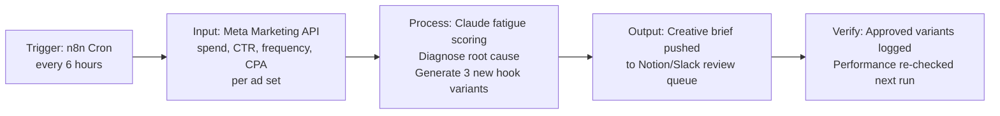

# Meta Ads Creative Automation Engine — Workflow

## Layers

| Layer | Tech |
|-------|------|
| Trigger | n8n Cron node |
| Input | Meta Marketing API |
| Processing | Claude — fatigue scoring + hook generation |
| Output | Notion/Slack review queue |
| Verification | Run-over-run performance comparison, logged |
